## Firmware 1.2.5 User Manual

OpenGarage is a fully open-source product. Hardware and software details are all published at the [OpenGarage GitHub repository](https://github.com/opengarage). For additional details, video tutorials, technical support, and user forum, visit [https://opengarage.io](https://opengarage.io).

### What's New in Firmware 1.2.5?

* More robust distance consensus filtering: uses the tightest five readings to tolerate outliers.
* Improved Security+ 1.0 operation when an existing smart wall panel is present.
* Improved Security+ 2.0 client ID, with an option to regenerate it without a factory reset.
* Automatic Security+ 2.0 recovery after an opener power outage.
* Smoother audible warnings and distinct startup tunes for AP mode and station mode.

**NOTE**: This firmware reserves `G05` for Security+ protocol, so it's no longer available for sensors. `G04` is a shared pin that can be assigned as either a switch sensor or a temperature/humidity sensor, but **not both simultaneously**.

### Using Home Assistant

Home Assistant supports the stock firmware through its built-in OpenGarage integration. For additional Security+ controls in Home Assistant, see the alternative [ESPHome-based OpenGarage firmware](https://github.com/OpenGarage/OpenGarage-ESPHome). Both options are described in [Step 6](#step-6-browser-mobile-app-and-home-assistant-integration).

### Hardware Setup

!!! warning "OpenGarage is **not waterproof**"
    If installing outdoors, place it inside a **waterproof enclosure**.

OpenGarage has a built-in ultrasonic distance sensor for detecting door status and car presence, a pushbutton, and a microUSB connector for power.

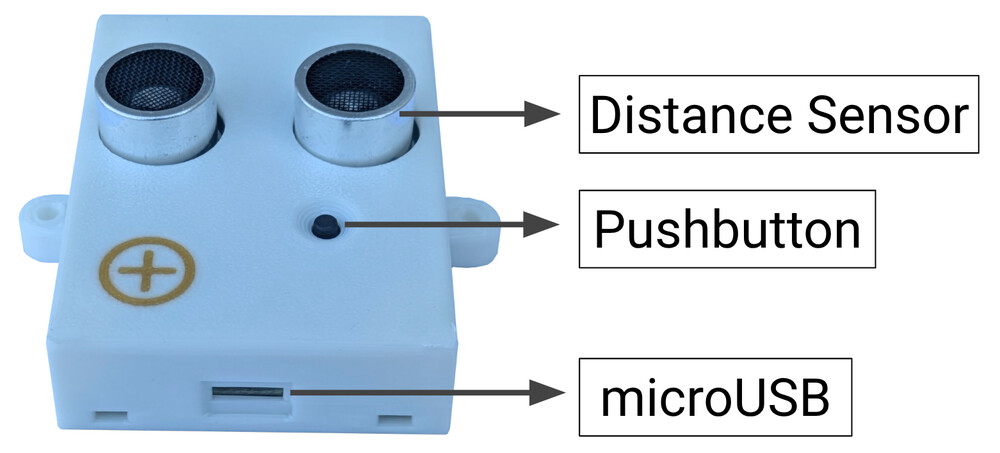{: .center }

#### Step 1: Locate Door-Button Terminals

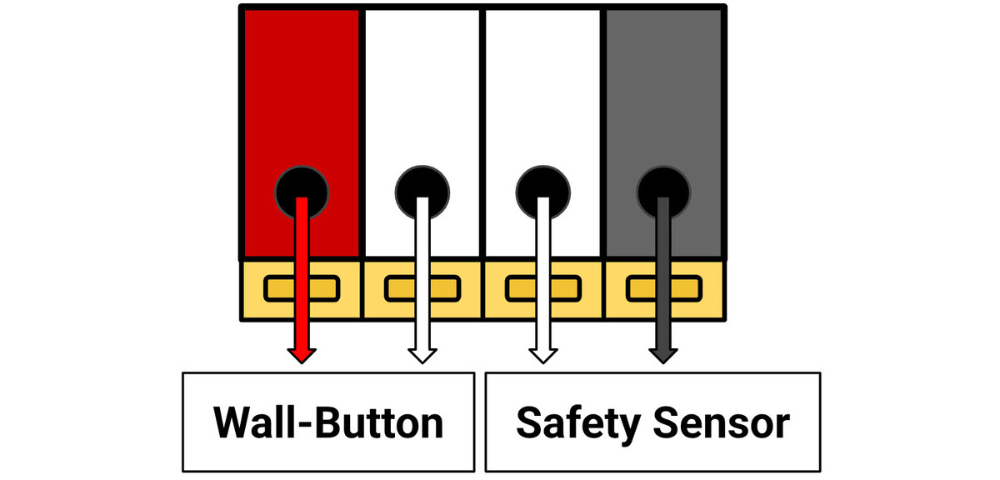{: .center }

On **your garage opener's motor unit**, locate the terminals that connect to the **wall button** (also called console or door control). OpenGarage communicates with the opener through these terminals. Most openers have **four** terminals:

  * Two for the **wall-button** — typically colored Red (Signal) and White (Ground). These are the ones OpenGarage connects to.
  * Two for the **safety sensor** — typically colored Gray (Signal) and White (Ground).

If you are unsure, or your terminals don't have these colors: simply identify which terminals are connected to your existing wall button, or refer to your opener’s user manual.

#### Step 2: Wiring

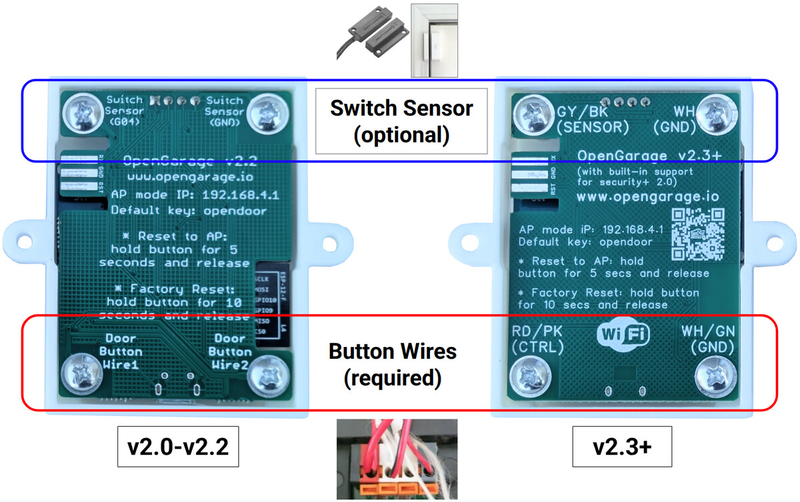{: .center_wider }

OpenGarage v2.x has four integrated screw terminals. Flip the device over to identify the terminals on the back:

* The **bottom** two connect to your opener's **wall-button** terminals. These are **required**.
* The **top** two are optional: they can be connected to a magnetic switch sensor.

Use the two-wire cable from your OpenGarage package to connect the **bottom** two screws to your opener's **wall-button** terminals identified in Step 1 above:

  * On OpenGarage **v2.0—2.2**, the terminals are labeled **Door Button Wire1** and **Door Button Wire2**. They are **non-polarized**, so can be connected in either orientation.
  * On OpenGarage **v2.3+**, they are labeled **Red/Pink (CTRL)** and **White/Green (GND)** respectively. These are <u>**polarized**</u>:
      * **CTRL** must go to your opener's Red (Signal) terminal
      * **GND** must go to your opener's White (Ground) terminal.
      * The included cable uses Pink and Green for internal wire colors. Use **Pink as Red**, and **Green as White**. If using your own cable, they are typically colored Red and White.
    !!! warning "Voltage Compliance"
        v2.3+ is designed primarily for **LiftMaster, Chamberlain, and Craftsman** brands, which operate their wall-buttons at 12VDC. If you plan to use it with other brands, make sure your wall-button terminals output **DC only**, and **below 20 VDC**. Applying AC voltage or DC voltage above 20V can permanently damage the v2.3+ circuit. Use v2.2 instead.

To connect the wires:

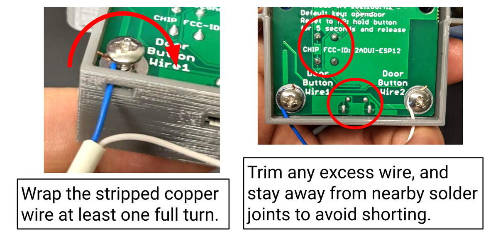{: .center_wider }

  * Loosen the screws on the bottom two terminals.
  * Strip the wire ends to an appropriate length. Then insert the stripped copper wire through the enclosure hole.
  * Using tweezers, a small screwdriver, or needle-nose pliers, wrap the wire **around the screw at least one full turn**.
  * Tighten the screw securely.
  * Repeat for the second terminal.
  * Trim any excess wire to ensure it doesn't touch nearby solder joints.
  * Finally, strip the other ends of the cable and insert them into your opener's wall-button terminals, following the color guide.

#### Step 3: Mounting

The best location to mount OpenGarage is on the **ceiling**, with the distance sensor facing down. The ideal position depends on how the device senses the door status:

* **For OpenGarage v2.0—2.2**, or **v2.3+ with Security+ set to `None`**: The device uses the distance sensor to detect the door's open status. Therefore, position the device so it has an **unobstructed view of** your garage **door** when it's **open**, and the top of your **car** when the door is **closed**.
    * <u>**NOTE**</u>: When the door is open, the car status is unavailable, as the door blocks the sensor's view of the car.

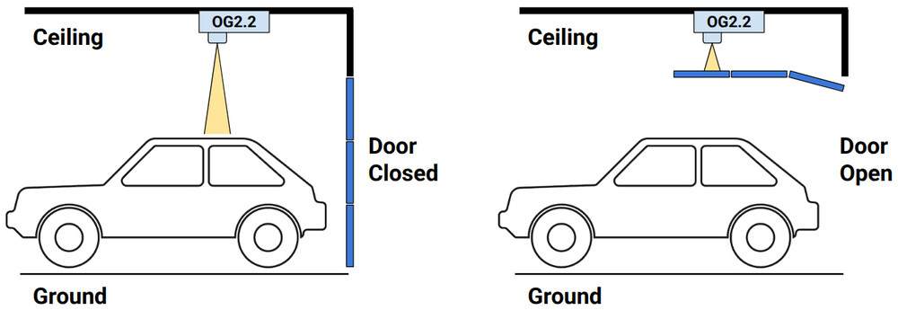{: .center_wider }

* **For OpenGarage v2.3+** with **Security+ set to `2.0` or `1.0`**: The device obtains the door status directly via the Security+ protocol. The distance sensor is used solely for detecting car presence. Therefore, position the device such that it has an **unobstructed view of your car** at all times, regardless of the door's position.
    * <u>**NOTE**</u>: Car status remains available whether the door is open or closed.

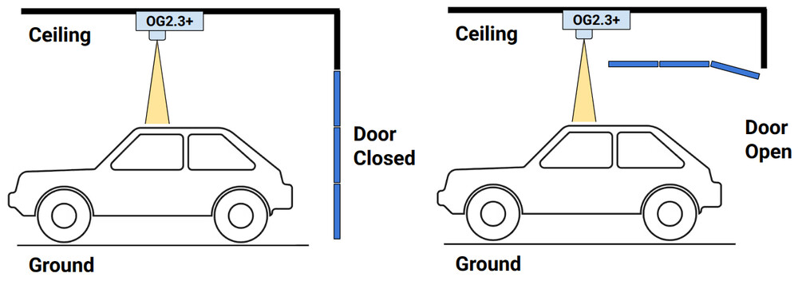{: .center_wider }

!!! warning "**Areas to Avoid**"
    Do **NOT** mount the device directly above or too close to the metal garage door rail or chain. These objects can interfere with distance sensor readings.

Once you've chosen a good location, use **screws** or **strong double-sided tape** to mount the device securely.

### Software Setup

This section walks you through powering on your OpenGarage, connecting it to your WiFi network, and accessing its web interface for the first time.

#### Step 1: Power-Up and AP Mode

* Plug a microUSB cable into the device and connect it to a USB power adapter.

* The first time it powers on (or after a WiFi/factory reset), the device creates an open WiFi Access Point (AP) named `OG_` followed by the last six hexadecimal characters of its MAC address. For example: `OG_67FA8A`. Use your phone, tablet, or computer to find this network and connect to it.

#### Step 2: WiFi Configuration

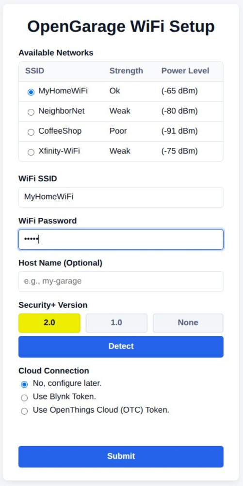{: .center }

* After connecting to the `OG_` network, most smart devices will automatically prompt you to "Sign In".
    * If you don't see this prompt or "Sign In" page, manually open a web browser and go to `192.168.4.1`.
* Follow the on-screen instructions (see the screenshot above):
    * **Either select or enter** your WiFi router's name (SSID) and type its password.
    * **Host Name** *(Optional)* : Enter a custom hostname (e.g. `myog`). This makes it easy to access the device later using a domain name like `http://myog.local`.
    * **Security+ Detection** *(Optional, OpenGarage v2.3+ only)* : If you have wired your v2.3+ to your garage opener, click **Detect** to automatically detect the Security+ protocol version. This feature is hidden on OpenGarage v2.2 and earlier as they do not support Security+.
    * **Cloud Token** *(Optional)* : If you already have a Blynk or OTC token (see the [Cloud Connection](#step-5-cloud-connection) section), enter it here. Otherwise, select `No` and you can configure it later.
* Click **Submit**. Upon a successful connection, you will hear a short tune from the buzzer. Your WiFi credentials are saved and the device reboots into WiFi **Client Mode**, where it automatically obtains a **Device IP** address from your router. This device IP is typically displayed at the bottom of the screen upon the completion of this step.

#### Step 3: Access the Device Locally on Your Network

Now that OpenGarage is connected to your home network, you can access it locally using its device IP.

* Open a browser on a smart device or computer that is connected to the same home WiFi network as OpenGarage, and enter the device IP.
* **Device Key**: To perform certain actions like triggering the door or changing settings, you need to enter a Device Key.

    !!! info "The Default Device Key is:"
        <strong>opendoor</strong>

**Finding the Device IP**: If you don't know your OpenGarage's device IP, there are several ways to find it:

* Check your router's **Client List**: Log in to your WiFi router's administration page and look for a list of connected devices. The OpenGarage should appear there with its assigned IP address.
* **mDNS**: If you entered a custom **Host Name** during WiFi configuration (e.g. `myog`), you can access it using the mDNS name `http://myog.local/` (i.e. the host name followed by `.local/`). If you left the host name empty, it uses the default host name, which is `OG_` followed by the last six hexadecimal characters of its MAC address (same as AP-mode SSID). In the example above, it will be `http://OG_67FA8A.local/`.
* **Audible IP**: Press and hold the onboard pushbutton for **2 to 4 seconds**, then release. The device will beep out its IP address using tones (see [Button Actions](#step-4-button-actions) below).

#### Step 4: Button Actions

The pushbutton on OpenGarage has several useful functions depending on how long you press it:

* **Trigger Door Action**: Tap and release within about 0.8 seconds to toggle the door, similar to a wall button. Dry-contact mode pulses the relay; Security+ mode sends a protocol command.
* **Report IP**: Hold 2-4 sec and release → the device IP is reported as sequences of rising notes, pauses, and high-pitch tones for dots. For example: `192.168.1.10` is beeped out as a `C4` (the leading `1`), followed by a pause; then sequence `C4, C#4, D4...` continuously until `G#5`, indicating digit `9`, followed by a pause; then `C4, C#4` and pause, indicating `2`; then a high-pitch tone, indicating a dot; and so on. Count the number of notes in each sequence to determine the digit.
* **Reset to AP Mode**: Hold 5-9 sec until the LED toggles state (from off to on), then release → resets the device to WiFi AP Mode. This allows you to reconfigure WiFi without losing settings and log data.
* **Factory Reset**: Hold 10+ sec until the LED turns on and then off → resets the device back to factory default. This erases all settings and data, restoring the device to its original state.

#### Step 5: Cloud Connection

To control and monitor your OpenGarage remotely from anywhere, you'll need to set up a cloud connection. OpenGarage supports two cloud services:

* **OTC** (OpenThings Cloud): Allows full remote access to the built-in web UI. All features are supported except firmware upgrade.
* **Blynk**: Allows remote status checks and door control, but does **not** allow settings, logs, or firmware upgrade.

!!! info
    For detailed instructions on setting up and using cloud services, refer to the **[Cloud Connection Support Article](https://openthings.freshdesk.com/a/solutions/articles/5000878722)**.

#### Step 6: Browser, Mobile App, and Home Assistant Integration

* **Browser Access**
    * OpenGarage provides a [built-in web UI](#built-in-web-interface) accessible directly from any browser using the device's local IP or hostname.
    * Remote access via browser is also supported through the OTC cloud connection using the [OTC base url](api.md#otc-openthings-token).
* **Web App**
    * A lightweight [**OpenGarage Web App**](https://raysfiles.com/og/og_devices.html) is available for conveniently managing **multiple OpenGarage devices**. It supports both local access (via device IP) and remote access (via Blynk or OTC), and runs entirely in your browser — no installation required.
    * You can bookmark the link or use **Add to Home Screen** to install it as a standalone app. 
* **Native App**
    { align=right width=100 }
    * The official **OpenGarage Web** app is available for installation in both the [iOS App Store](https://apps.apple.com/us/app/opengarage-web/id6758858574) and [Google Play Store](https://play.google.com/store/apps/details?id=io.opengarage.app). It provides a native app interface for door control, status, and multiple device management.
    * The firmware still works with the Blynk legacy app (officially discontinued but may still be available on third-party websites). Instructions can be [found here](../archive.md#blynk-legacy-app).
* **Home Assistant Integration**
    * Home Assistant includes a built-in [OpenGarage integration](https://www.home-assistant.io/integrations/opengarage/) for the stock firmware. It provides door control, vehicle presence and distance readings, and optional temperature/humidity readings.
    * For more native Home Assistant integration with additional features such as Security+ opener light and remote lock, use the alternative [ESPHome-based OpenGarage firmware](https://github.com/OpenGarage/OpenGarage-ESPHome). Installing it replaces the stock firmware.
* **API and MQTT**
    * OpenGarage exposes a simple, well-documented [HTTP API](api.md) as well as MQTT support. You can use these to write custom scripts, integrate with third-party apps, or connect through any MQTT client.

### Built-in Web Interface

#### Homepage

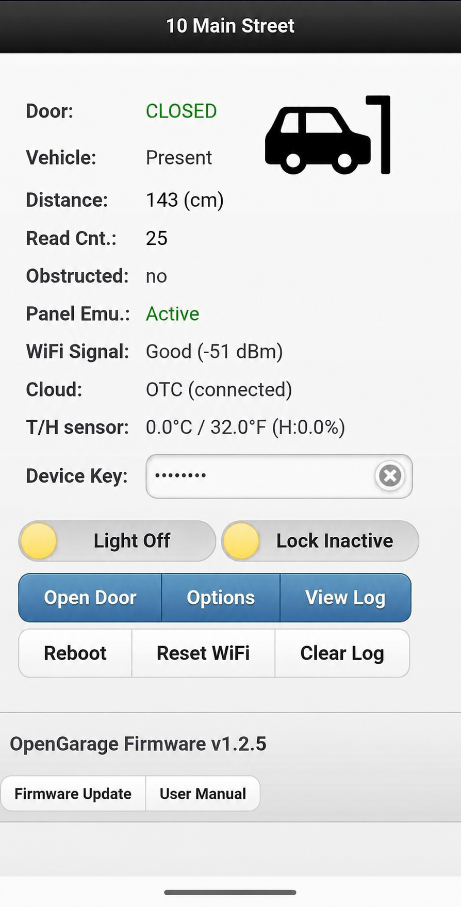{: .center }

The homepage displays a real-time overview of your device's status including:

* **Door** status
* **Vehicle** detection status
* **Distance** sensor value
* **Switch** sensor state (*if enabled*)
* **Obstruction** sensor status (*Security+ 2.0/1.0 only*)
* **Panel Emulation** mode (*Security+ 1.0 only*)
* **WiFi Signal** strength
* **Cloud** connection status
* **Temperature/Humidity** sensor readings (*if enabled*)

You can also perform several key operations including:

* **Open/Close/Toggle door**
    * In dry-contact and Security+ 1.0 modes, Open/Close requests use the same toggle action as the wall button. Only Security+ 2.0 provides directional Open and Close commands.
* **Reboot Device**
* **Reset WiFi**
* **Clear Log**.
* **Toggle Light and Remote Lock** (*Security+ 2.0/1.0 only*)
    * After a click, the switch is temporarily disabled while waiting for confirmation (up to four seconds). If confirmation does not arrive, it returns to the last reported state and shows a message; it does not automatically retry. Unknown light/lock status keeps the controls disabled until fresh status arrives.

All of these actions require the **Device Key** (default: `opendoor`), except when accessed remotely via OTC token, where the key is not required. For convenience, the key is cached in your browser and can be cleared by clicking the ✖ icon next to it.

The homepage also provides navigation links to **Edit Options**, **Show Log**, **Firmware Update**, and the **User Manual**.

#### Security+ Communication

With a Security+ 1.0 smart wall panel, OG waits for a suitable gap between panel exchanges before transmitting. If no gap is available within two seconds, the request expires without being sent. If this happens repeatedly, turn off opener power before disconnecting the smart wall panel, then restart OG so it can emulate one. Keep the opener's safety sensors connected and operational.

For Security+ 2.0, OG automatically retries communication after an opener outage. Recovery can take several minutes after a prolonged outage. It does not replay previous door commands.

#### Edit Options

Editing any option requires the Device Key (except when accessed remotely via OTC token). Some options take effect only after a reboot — these are marked `[Effective after reboot]`. The options are divided into three tabs:

##### 1. Basic Tab

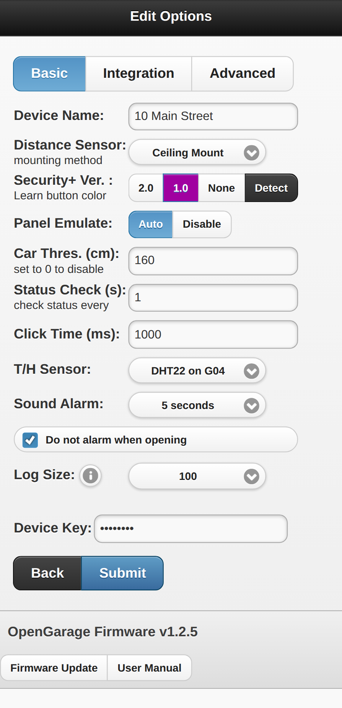{: .center }

* **Device Name**: A custom name shown on the homepage.
* **Distance Sensor**: How the device is mounted:
    * **Ceiling Mount** (default): The most common use, where the device is mounted on the ceiling with the ultrasonic distance sensor facing down.
    * **Side Mount**: For roll-up doors or when ceiling mount is not feasible: mount the device on the side of the door facing outward.
* **Security+ Version**: Available only on **OpenGarage v2.3+** and applies to **LiftMaster, Chamberlain, and Craftsman** brands. You can typically identify the version by the color of the **Learn** button or **antenna wire** on the motor unit:
    * **2.0**: **Yellow**
    * **1.0**: Purple, Orange, or Red
    * **None**: Green, or any brand not listed above
    * **Detect**: If you're unsure of your version, click **Detect** to automatically probe and select the correct type.

    !!! danger
        The detection can take up to 15 seconds, and **the door may activate or move** during this time. Ensure the door's path is clear before proceeding.

    !!! warning "Note on Security+ 1.0"
        In **Security+ 1.0** mode, the device can **emulate a smart wall panel** by sending rapid probing signals needed to obtain door status (unless an existing smart wall panel is detected). This disables traditional, non-smart wall-buttons. If this restriction is undesirable, set Security+ to `None`. Security+ 2.0 systems do not require panel emulation.

* **Panel Emulate** (Security+ 1.0 only): **Auto** (default) detects an existing smart wall panel and otherwise emulates one. **Disable** never emulates a panel; use it only when a compatible smart panel is already connected. Without one, door status and Security+ controls may remain unavailable. The change takes effect when you submit the options.
* **Client ID** (Security+ 2.0 only): Shows the current client ID. **Regenerate Sec+ 2 Client ID** creates a new ID and restarts OG, preserving WiFi and other settings. The button is available after Security+ 2.0 is saved. Use it only to troubleshoot an identity/synchronization problem; it requires the device key even through OTC.

* **Door Threshold**: Distance (in `cm`) used to determine if the door is open.
    * Set it larger than the distance from the ceiling to the door when fully open, but smaller than the ceiling-to-car distance.
    * Example: if the distance from ceiling to the fully-open door is 30 cm, set the threshold to `50 cm` to provide a reliable margin.
    * This option is <u>only available</u> if **Security+ Version** is **None**. For Security+ 2.0/1.0, the door status is obtained from the Security+ protocol and not by the distance sensor.
* **Car Threshold**: Distance (in `cm`) used to determine if a car is detected.
    * Set it larger than the ceiling-to-car distance, but smaller than ceiling-to-ground distance.
    * The diagram below illustrates how to set the Door and Car thresholds.

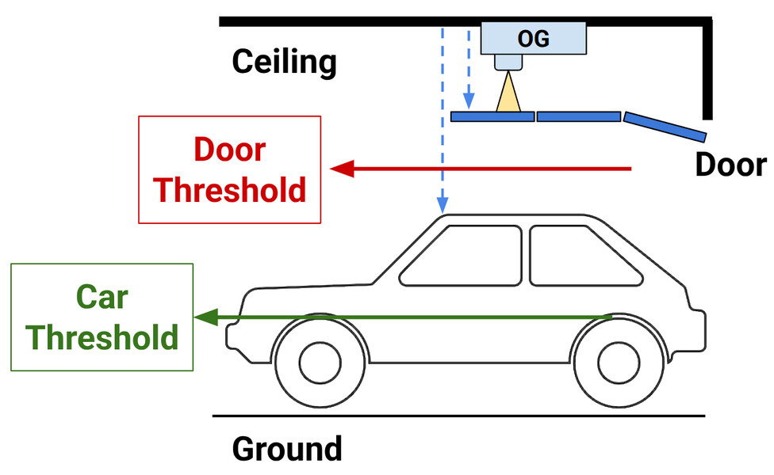{: .center }

* **Status Check Interval**: How often (in `seconds`) the device checks all sensors. Default: `1`.
* **Click Time**: Duration (in `ms`) the relay is held when triggered in dry-contact mode. Default: `1000 ms`.
* **Switch Sensor**: (<u>only available</u> if **Security+ Version** is **None**) Configure an optional magnetic sensor (connected between pin `G04` and `GND`) for door detection. Options:
    * **Normally Closed**: most common type; switch is closed/shorted when door is closed
    * **Normally Open**: switch is open when door is closed

* **Sensor Logic**: (<u>only available</u> if **Security+ Version** is **None**) If a switch sensor is enabled, you can define how the distance and switch sensors together determine the door status:
    * Distance Sensor Only
    * Switch Sensor Only
    * Distance `AND` Switch — door considered open only if both sensors report open
    * Distance `OR` Switch — door considered open if either reports open

* **T/H Sensor** `[Effective after reboot]`: Select the type of optional temperature/humidity sensor (requires soldering). Supported sensors:
    * DHT11/DHT22 (data pin on `G04`)
    * DS18B20 (data pin on `G04`, requires `10 kΩ` pull-up resistor)
    * The sensor must be powered by `VCC` (3.3 V) and `GND`

    !!! info
        Because `G04` is a shared pin for sensors, it can be assigned to **either** a switch sensor **or** a temperature/humidity sensor, but **NOT both simultaneously**.

* **Sound Alarm**: Set the duration for the audible alarm before OG-initiated web, app, or API door actions. A short press of OG's physical button bypasses this alarm.
    * Includes an option to disable the alarm specifically for door opening.
* **Log Size**: Number of log records to retain.
    * After changing, go to the homepage and click **Clear Log** for it to take effect.

##### 2. Integration Tab

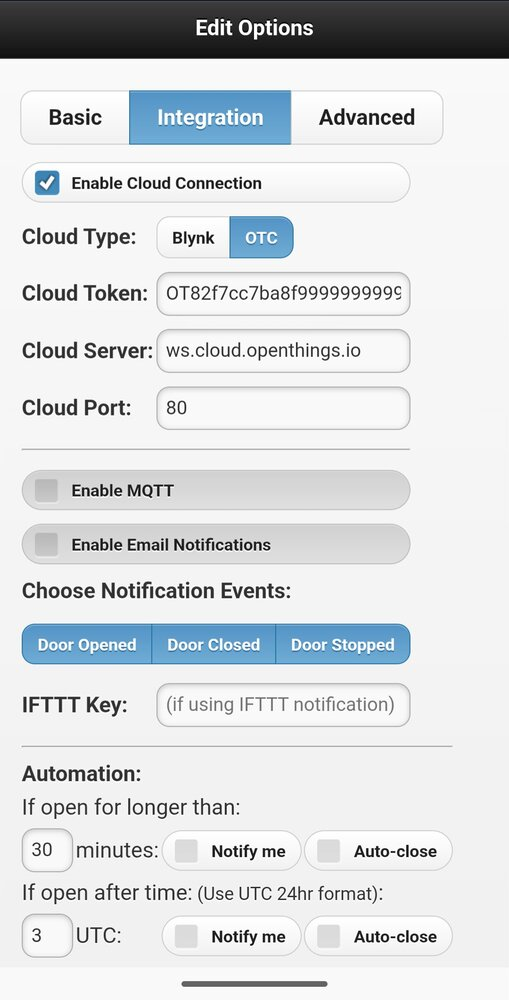{: .center }

* **Enable Cloud Connection** `[effective after reboot]`: Select **Blynk** or **OTC** for cloud service, and enter the **Cloud Token**. The default **Cloud Server / Port** are:
    * Blynk: `blynk.openthings.io`, port `8080`
    * OTC: `ws.cloud.openthings.io`, port `80`

* **Enable MQTT**: Enable MQTT communication by providing the MQTT server URL, port, credentials (optional), and a custom MQTT topic.
    * If topic is left blank, the device name is used.

* **Enable Email Notifications**: Set up email notifications by providing an SMTP server, credentials, and recipient address.
    * For detailed instructions, refer to the [Setting Up Email Notifications Support Article](https://openthings.freshdesk.com/support/solutions/articles/5000889759).

    !!! warning "Info"
        When using MQTT or Email Notifications, please ensure all fields are correct. Empty or incorrect values may cause the device to become unresponsive.

    !!! tip "Optional: Push Notifications"
        To receive dedicated push notifications beyond email, use a service like [Pushover](https://pushover.net). Sign up for Pushover and use its unique email gateway address as the recipient in your **Email** settings.

* **IFTTT Key**: Webhook service key for IFTTT integration.
    * Create an [IFTTT](https://ifttt.com/) account, search "Webhook" service and create a key, then copy your key here. You can then create **applets** triggered by the `opengarage` event name, with SMS, email, or push notification as the action. The notification message is passed via parameter `value1`.

* **Choose Notification Events**: Select which events generate notifications. Applies to all of Blynk, Email, IFTTT, and MQTT.

* **Automation**: Set up rules to automatically notify you or close the door if it has been left open beyond a certain amount of time, or past a specific UTC time.
    * Time is in UTC, as the controller does not know your local timezone. Example: to close at 6 PM local (UTC-4), set 22 (6 PM + 4 h = 22 UTC).
    * A minimum 5-second sound alarm is enforced before auto-close.

##### 3. Advanced Tab

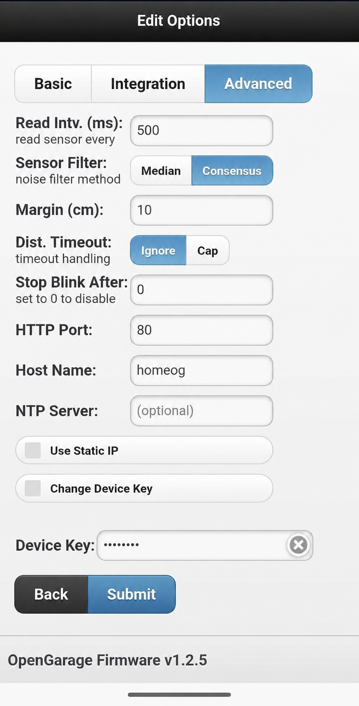{: .center }

* **Read Interval** `[effective after reboot]`: Time (in `ms`) between ultrasonic distance sensor readings. Default: `500 ms`.
    * Increasing this value can help reduce noise.

* **Sensor Filter** method:
    * **Median**: Use median of the last 7 readings.
    * **Consensus**: Select the five readings with the smallest spread from the last seven, and average them if their range `(max–min) ≤ margin`. Otherwise retain the last accepted distance. **Margin** defines the range tolerance (default: `10 cm`).
    * If Consensus fails often, increase margin (e.g. `20 cm`) or switch to Median filter.

* **Distance Timeout**: How to handle ultrasonic sensor timeout:
    * **Ignore** (default): Ignore invalid readings to reduce noise.
    * **Cap** at the maximum which is `450 cm`.

* **HTTP Port** `[effective after reboot]`: Custom web server port (default: `80`).

* **Hostname** `[effective after reboot]`: Custom local hostname.
    * If left blank, defaults to the WiFi AP name (refer to [WiFi configuration](#step-2-wifi-configuration)).
    * Allows access via `http://<hostname>.local/` instead of numeric IP.

* **NTP Server** `[effective after reboot]`: Custom time server; defaults to `pool.ntp.org` if blank.

* **Use Static IP** `[effective after reboot]`: Manually assign a fixed IP instead of DHCP.
    * Requires manual entry of **Device IP**, **Gateway IP**, **Subnet**, and **DNS1**.

* **Device Key**: Change the Device Key from the default `opendoor` to your own password.

### Firmware Update

Follow the [firmware update instructions](../index.md#firmware-update-instructions).

### Links and Resources

* [OpenGarage Homepage](https://opengarage.io/)
* [OpenGarage GitHub Repository](https://github.com/opengarage)
* [OpenGarage Documentation](https://opengarage.github.io/OpenGarage-Firmware/)
* [OpenGarage Blog Post](https://rayshobby.net/introducing-opengarage/)

