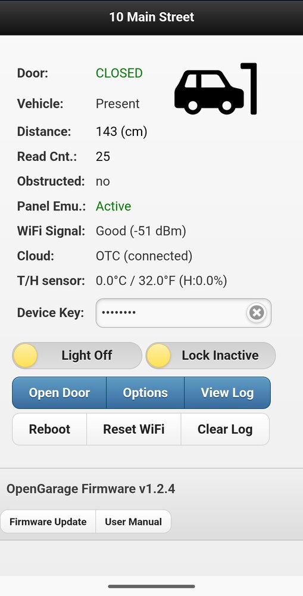
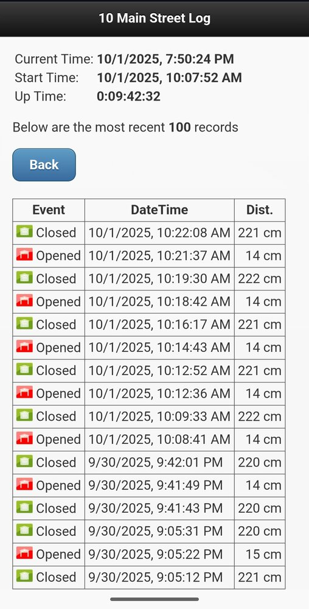
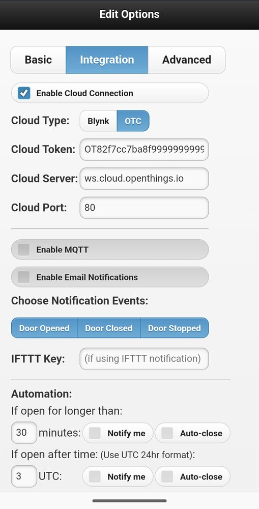
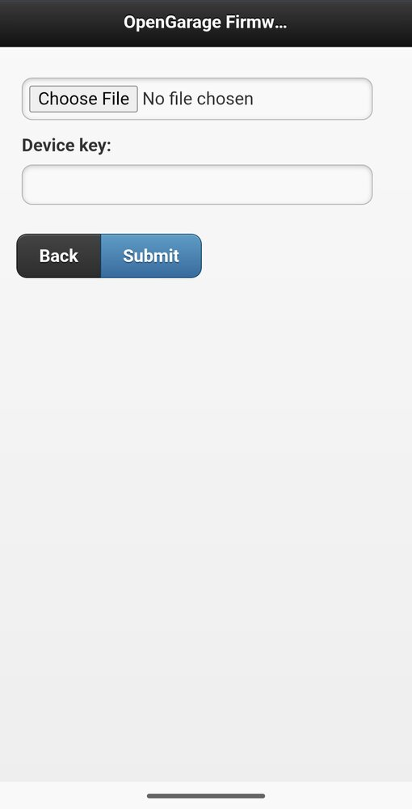
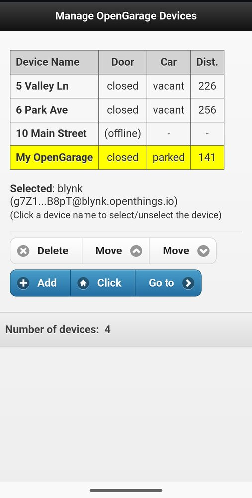

# OpenGarage Firmware and Documentation

This Github repository contains the firmware source code and documentation for OpenGarage. For product details, visit [https://opengarage.io](https://opengarage.io).

For official firmware release notes, please go to the [OpenGarage Firmware Releases](https://github.com/OpenGarage/OpenGarage-Firmware/releases) page on GitHub.

## OpenGarage's Built-in Web UI

{width="220"} {width="220"} {width="220"}
{width="220"} {width="220"} {width="220"}
{width="220"} {width="220"} {width="220"}

---

## Firmware Compilation Instructions

### Environment Setup
1.  Download and unzip (or git clone) this (`OpenGarage-Firmware`) repository.
2.  Install the latest LTS version of Node.js from [https://nodejs.org/](https://nodejs.org/) if you don't already have it.
3.  In your terminal, navigate to the `OpenGarage-Firmware/OpenGarage` folder (the source code folder) and run `npm install html-minifier-terser`.
4.  Install Visual Studio Code (VS Code) from [https://code.visualstudio.com/](https://code.visualstudio.com/), if you don't already have it.
5.  Launch VS Code and install the **PlatformIO** extension.

### Building the Firmware
1.  In VS Code, click `File -> Open Folder` and select the `OpenGarage-Firmware/OpenGarage` folder.
2.  PlatformIO will recognize the `platformio.ini` file in that folder, which contains all the libraries and settings needed to compile the firmware.
3.  Click the **PlatformIO: Build** button (with the checkmark icon ✓) in the blue status bar at the bottom of the screen to build the firmware.

### Making Changes to the UI
* The built-in web UI files are located in the `html` subfolder.
* You do not need to run any scripts manually. When you build the project, a Python script (`run_prebuild.py`) automatically calls the `compress_htmls.mjs` script to minify, compress, and convert the HTML files into firmware program strings stored in `htmls.h`, which are then compiled into the final firmware.
* After editing any files in the `html` folder, simply build the project again.
---

## Firmware Update Instructions

OpenGarage firmware supports OTA (over-the-air) updates, allowing you to upload the firmware directly through the web UI.

### Update Steps
1.  [Download a firmware file](#list-of-opengarage-firmwares) (e.g. `og_x.x.x.bin` where `x.x.x` is the firmware version).
2.  Before starting, close the Blynk and OpenGarage mobile apps to prevent them from interfering with the update process.
3.  Open your OpenGarage's homepage, click `Firmware Update` at the bottom of the page.
    - *If your OpenGarage is in WiFi AP (Access Point) mode, the update page is available at `http://192.168.4.1/update`.*
4.  Select the firmware file your downloaded, enter your device key, and click `Submit`.
5.  Wait for the process to finish. If the upload fails, you can try again. If the device hangs, unplug and replug the power, then try again.

### Troubleshooting
* **Firmware Corruption**: If the firmware upload fails and the device no longer boots, you'll need to re-flash the firmware using a [USB-serial programmer](https://opensprinkler.com/product/usb-programmer/).
* **Flash Memory Requirement**: Early OpenGarage units (v1.0, v1.1, v1.2, made before 2018) have only 2MB of flash memory. These cannot be upgraded to firmware 1.2.0 or later, which require 4MB. All newer versions (v1.3 and above) include 4MB flash and support the latest firmware.
* **Checking Flash Size**: If you are unsure how much flash memory is available on your OpenGarage, you can first update to firmware 1.1.3. After the update, open a browser and go to `http://<your_og_ip>/db`. This will display a JSON string. Look for the `flash_size` value: if it's `4194304`, you have 4MB of flash and can upgrade. If it is `2097152`, your device is not upgradeable to firmware 1.2.0 and beyond.
* **Factory Reset Warning**: Upgrading from an early firmware to version 1.2.0 will **erase all setings** due to changes in the flash memory layout. Be sure to write down your configuration before proceeding.

### List of OpenGarage Firmwares

The release notes of each firmware can be found on [github](https://github.com/OpenGarage/OpenGarage-Firmware/releases).

| Download | Documentation |
|:------- |:---------------|
| [**`1.2.4.bin`**](assets/bins/og_1.2.4.bin) | [[Manual](1.2.4/manual.md)], [[API](1.2.4/api.md)] |
| [`1.2.3.bin`](assets/bins/og_1.2.3.bin) | [Docs](archive.md) |
| [`1.2.1.bin`](assets/bins/og_1.2.1.bin) | |
| [`1.2.0.bin`](assets/bins/og_1.2.0.bin) | [Archive](archive.md) |
| [`1.1.3.bin`](assets/bins/og_1.1.3.bin) | |
| [`1.1.2.bin`](assets/bins/og_1.1.2.bin) | [Archive](archive.md) |
| [`1.1.1.bin`](assets/bins/og_1.1.1.bin) | |
| [`1.1.0.bin`](assets/bins/og_1.1.0.bin) | |
| [`1.0.9.bin`](assets/bins/og_1.0.9.bin) | [Archive](archive.md) |
| [`1.0.8.bin`](assets/bins/og_1.0.8.bin) | |
| [`1.0.7.bin`](assets/bins/og_1.0.7.bin) | [Archive](archive.md) |
| [`1.0.6.bin`](assets/bins/og_1.0.6.bin) | [Archive](archive.md) |
| [`1.0.5.bin`](assets/bins/og_1.0.5.bin) | [Archive](archive.md) |
| [`1.0.4.bin`](assets/bins/og_1.0.4.bin) | [Archive](archive.md) |
| [`1.0.3.bin`](assets/bins/og_1.0.3.bin) | |

---
